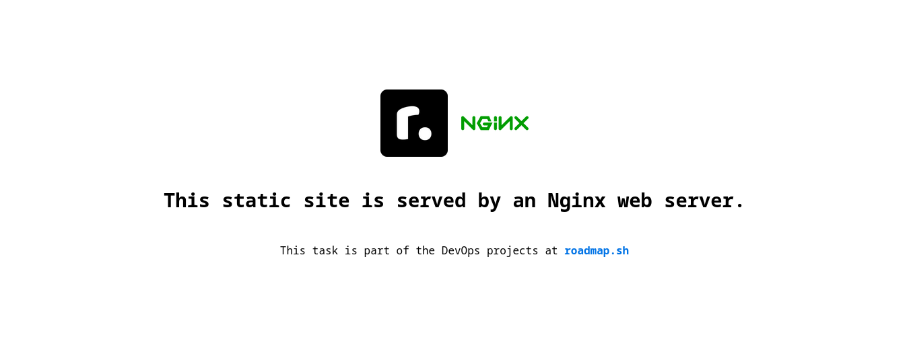

# Static Site Server 

First, I created the `index.html` file on my local host, a static website that explains the project and also presents the logos of `roadmap.sh` and `nginx`.

Next, I installed `nginx` on the server with the following command:

```bash
apt install nginx -y
```

Then, I created a configuration file for the static website in `/etc/nginx/conf.d`:

```nginx
server {
    listen 80;

    root /var/www/html;
    index index.html;

    location / {
        try_files $uri $uri/ =404;
    }
}
```

I also deleted the default files in the `sites_enabled` directories. Afterward, I ran the `sudo nginx -t` command to verify if there were any errors in the new configuration file.

Next, I checked if the service was enabled and then restarted it using:

```bash
systemctl restart nginx
```

To serve the new static site with the updated `index.html`, I created the `deploy.sh` script with the following content:

```bash
#!/bin/bash

echo "#DEPLOY STARTED..."

# Sync index.html and only updated PNG files
# rsync --update (-u): Only newer files are copied, saving time and bandwidth.
rsync -ruv --exclude-from='exclude.txt' index.html *.png ec2:/home/ubuntu/static_site

ssh ec2 << 'EOF'
  echo "Updating the server..."

  # Move index.html
  sudo cp /home/ubuntu/static_site/index.html /var/www/html

  # Move PNG images using a loop
  for img in /home/ubuntu/static_site/*.png; do
    sudo cp "$img" /var/www/html/
  done

  # Restart Nginx
  sudo systemctl restart nginx
  echo "Update completed!"
EOF
```

Note that I used `rsync` to synchronize the local static website in the project directory located on the server.

- `-r` is for recursive, `-u` ensures only newer files are copied, and `-v` enables verbose mode.
- Files that should not be sent are listed in the `exclude.txt` file, triggered by the `--exclude-from` parameter.

I then triggered commands via SSH to ensure the new files are placed in the directory used by Nginx to serve the static website.

And here is the website running perfectly:


